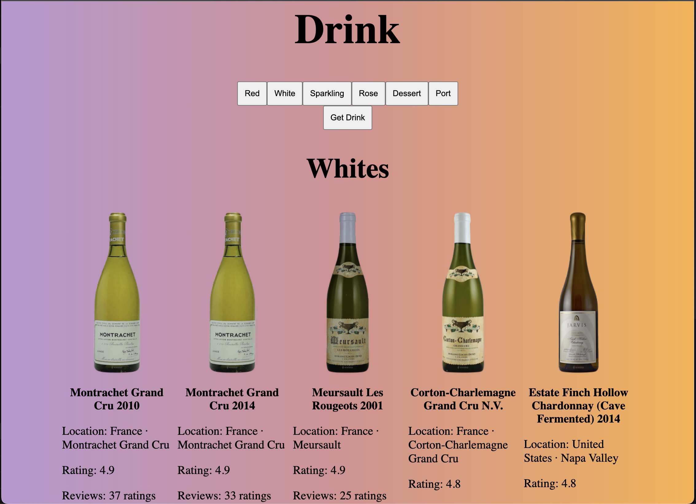

# Wine Cellar React

To enhance your React app utilizing useState, fetch, and Map with the SampleApi data, consider implementing error handling and incorporating additional features such as pagination or filtering to provide a more robust and user-friendly experience.

## Website
[click on this link](https://www.instagram.com)

 

## Features 
* useState()
* Fetch
* map ()

